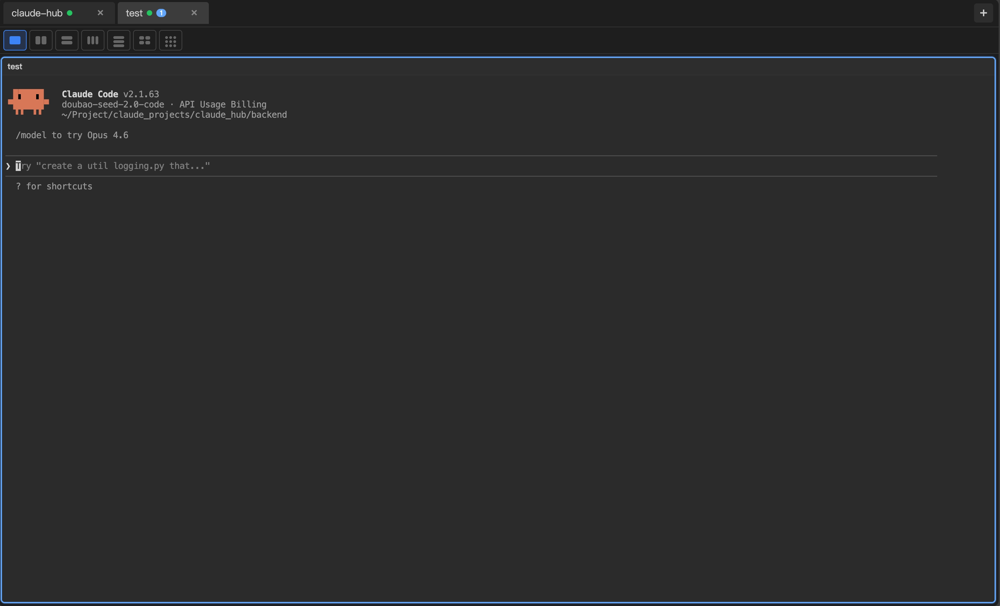

# Claude Hub

Web-based persistent Claude terminal service with tabbed interface.



## Features

- Create, delete, and switch between multiple terminal tabs
- Multi-pane layouts (1x1, 2x1, 1x2, 2x2, 3x3)
- Drag and drop tab reordering
- Persistent terminal sessions using ttyd + tmux
- Real-time WebSocket communication
- Optional Feishu OAuth authentication for public deployment
  - Open ID whitelist support (recommended)
  - Email whitelist support
- Cloudflare Tunnel support for public access
  - One-click startup script with auto .env update
- Vue 3 frontend with TypeScript
- FastAPI backend with Python

## Tech Stack

- **Frontend**: Vue 3 + TypeScript + Vite + Pinia
- **Backend**: Python 3.11+ + FastAPI + WebSocket + uv
- **Terminal**: ttyd

## Getting Started

### Prerequisites

- Python 3.11+
- Node.js 20+
- pnpm
- uv (https://docs.astral.sh/uv/getting-started/installation)
- ttyd

### Installation

#### Quick Setup (Recommended)

First, run the setup script to install uv (if missing) and check other dependencies:

```bash
./setup.sh
```

Then start the application:

```bash
./start.sh
```

#### Manual Installation

##### Backend

```bash
cd backend
uv sync --dev
```

#### Frontend

```bash
cd frontend
pnpm install
```

### Running the Application

#### Quick Start (Recommended)

Use the startup script to automatically start both backend and frontend:

```bash
./start.sh
```

To stop all services:
```bash
# Press Ctrl+C in the terminal where start.sh is running
# Or use the stop script:
./stop.sh
```

#### One-Click Public Tunnel (Cloudflare)

Start backend, frontend, and get a public URL with a single command:

```bash
./scripts/start-temp-tunnel.sh
```

This will:
- Automatically start backend, frontend, and Cloudflare Tunnel
- Get a random public URL like `https://random-name.trycloudflare.com`
- **Auto-update `.env` file** with the new public URL
- Show reminder to update Feishu redirect URL (if using authentication)

Press `Ctrl+C` to stop all services.

To manually stop services if needed:
```bash
./scripts/stop-all.sh
```

#### Authentication

The application supports optional Feishu OAuth authentication for public deployment. You can restrict access by:

- **Open ID whitelist** (recommended, more secure):
  ```env
  AUTH_ALLOWED_OPEN_IDS=your_open_id_here
  ```

- **Email whitelist**:
  ```env
  AUTH_ALLOWED_EMAILS=user1@company.com,user2@company.com
  ```

See [docs/DEPLOYMENT.md](docs/DEPLOYMENT.md) for full authentication setup instructions.

#### Public Deployment with Authentication

See [docs/DEPLOYMENT.md](docs/DEPLOYMENT.md) for:
- Feishu OAuth authentication setup
- Cloudflare Tunnel with persistent domain
- frp/ngrok alternatives
- Nginx reverse proxy configuration

#### Manual Start

##### Backend

```bash
cd backend
uv sync --dev  # First time only
uv run uvicorn claude_hub.main:app --reload --host 0.0.0.0 --port 8173
```

The backend will be available at http://localhost:8173

API docs: http://localhost:8173/docs

##### Frontend

```bash
cd frontend
pnpm install  # First time only
pnpm dev
```

The frontend will be available at http://localhost:5173

## Project Structure

```
claude_hub/
├── frontend/          # Vue 3 frontend application
├── backend/           # FastAPI backend application
├── docker/            # Docker configuration
└── .github/           # GitHub Actions workflows
```

## License

MIT
