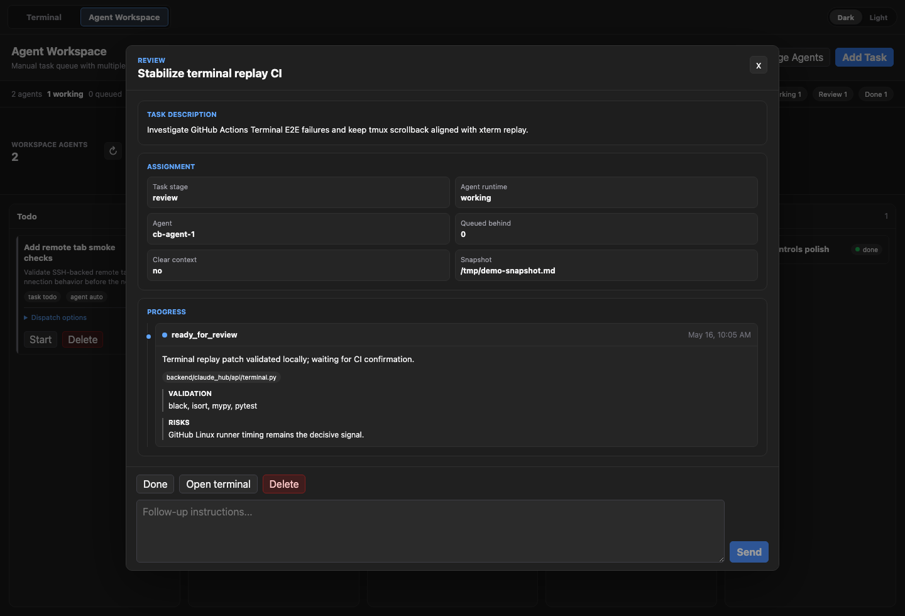

# Claude Hub

Persistent web dashboard for terminal-based AI agents.

Claude Hub keeps Claude, Codex, and shell sessions alive in `tmux`, serves them
through `ttyd`, and adds an Agent Workspace board for queueing tasks, dispatching
resident agents, sending follow-up instructions, and reviewing progress reports.



## What It Does

### Agent Workspace

- Manage one or more local or remote workspaces.
- Keep resident Claude or Codex agents running in persistent terminal tabs.
- Add tasks with optional pasted image attachments.
- Dispatch tasks to a specific agent or let the workspace choose the available agent.
- Track task state across Todo, Queued, Working, Review, and Done columns.
- Send follow-up messages from the task detail panel without leaving the board.
- Record agent reports with changed files, validation, risks, and review status.
- Preserve completed task records under the workspace state directory.

### Persistent Terminals

- Create Claude, Codex, or shell terminal tabs backed by `ttyd` and `tmux`.
- Switch, duplicate, rename, delete, and drag-reorder tabs.
- Use multi-pane layouts from single pane up to 3x3.
- Keep scrollback and visible terminal state aligned across reloads.
- Open remote SSH-backed tabs with optional remote working directories.
- Monitor best-effort agent runtime state: idle, working, attention, or offline.
- Paste local clipboard images into Claude or Codex terminal UIs through the
  browser-to-macOS clipboard bridge.
- Use mobile controls for common terminal shortcuts, including Ctrl+V.
- Toggle dark and light themes.

### Deployment And Access

- Optional Feishu OAuth for public deployments.
- Open ID and email whitelist support.
- Cloudflare Tunnel helper scripts for temporary or persistent public URLs.
- Local-network requests can bypass auth for trusted development use.

## Tech Stack

- **Frontend**: Vue 3, TypeScript, Vite, Pinia
- **Backend**: Python 3.11+, FastAPI, WebSocket, uv
- **Terminal runtime**: ttyd, tmux
- **Validation**: backend pytest/mypy/black/isort, frontend ESLint/type-check/build,
  and Playwright terminal replay E2E tests

## Requirements

- Python 3.11+
- Node.js 20+
- pnpm
- uv: <https://docs.astral.sh/uv/getting-started/installation>
- tmux
- ttyd
- cloudflared, optional for public tunnel scripts

## Quick Start

Install or verify local dependencies:

```bash
./setup.sh
```

Start backend and frontend together:

```bash
./start.sh
```

Open the app:

- Frontend: <http://localhost:5173>
- Backend API: <http://localhost:8173>
- API docs: <http://localhost:8173/docs>

Stop services with `Ctrl+C` in the `start.sh` terminal, or run:

```bash
./stop.sh
```

## Manual Development

Backend:

```bash
cd backend
uv sync --dev
uv run uvicorn claude_hub.main:app --reload --host 0.0.0.0 --port 8173
```

Frontend:

```bash
cd frontend
pnpm install
pnpm dev
```

## Public Tunnel

Start backend, frontend, and a temporary Cloudflare Tunnel URL:

```bash
./scripts/start-temp-tunnel.sh
```

The script starts all services, prints a `trycloudflare.com` URL, updates `.env`
with the public URL, and reminds you to update Feishu redirect settings when
auth is enabled.

For persistent deployment options, see [docs/DEPLOYMENT.md](docs/DEPLOYMENT.md).

## Authentication

Feishu OAuth is optional. For public access, configure either an Open ID
whitelist or an email whitelist:

```env
AUTH_ALLOWED_OPEN_IDS=ou_xxx
AUTH_ALLOWED_EMAILS=user@example.com
```

Open ID whitelisting is preferred when available. Full setup details are in
[docs/DEPLOYMENT.md](docs/DEPLOYMENT.md).

## Validation

Run the same checks used by CI:

```bash
cd backend
uv run black --check .
uv run isort --check .
uv run mypy .
uv run pytest -xvs --ignore=tests/test_terminal_replay.py
uv run pytest tests/test_terminal_replay.py -v
```

```bash
cd frontend
pnpm run lint:check
pnpm run build
```

The terminal replay tests require `tmux`, `ttyd`, and Playwright Chromium.

## Project Structure

```text
claude_hub/
├── frontend/          # Vue application
├── backend/           # FastAPI application and terminal/workspace services
├── docs/              # Deployment notes, screenshots, and working logs
├── scripts/           # Local startup and tunnel helpers
├── docker/            # Docker configuration
└── .github/           # GitHub Actions workflows
```

## Contributing

See [CONTRIBUTING.md](CONTRIBUTING.md) for the mandatory development workflow
(isolated worktrees, conventional commits, validation steps, and CHANGELOG
rules). **No change — even a small one — should be made directly on `main`.**

## Reference Docs

- [CLAUDE.md](CLAUDE.md): project conventions and development workflow
- [CHANGELOG.md](CHANGELOG.md): merge-level change history
- [docs/DEPLOYMENT.md](docs/DEPLOYMENT.md): auth and public deployment setup
- [docs/working-logs/](docs/working-logs): implementation notes and incident logs

## License

MIT
